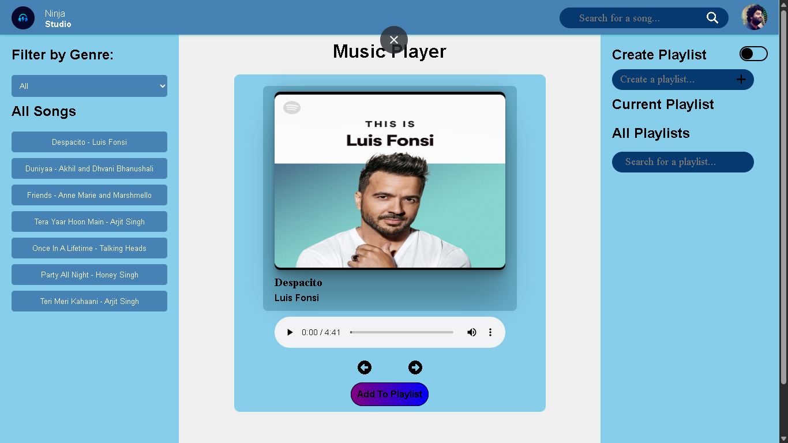
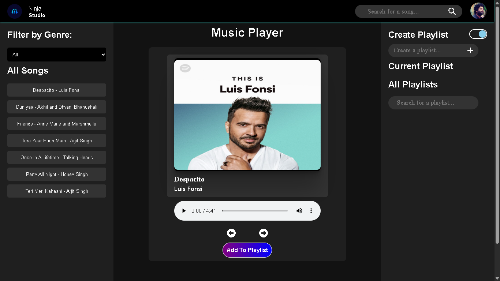

# Music-Player Project

## 🚀 Overview
The **Music Player** project delivers seamless audio playback with core features like play, pause, skip, and playlist management. Built with a responsive design and intuitive controls, it provides users with a smooth listening experience. The interface emphasizes simplicity and usability, making it accessible across devices for uninterrupted music enjoyment.

---

## 🛠 Tech Stack
### **Frontend**
- HTML
- CSS
- JavaScript

---

## ✨ Features
### Frontend
- Added Dark theme
- Song filter by genre.
- Song search 
- Customize playlist
- Add Play song forward & backward by button

---

## 📂 Project Structure
```
project-root/
│
├── frontend/       # Frontend code (React)
└── README.md     # This file
```

---

## 🚀 Deployment
- **Frontend:** Deployed on Netlify

---

The project is live!  
👉 **[View Live Demo](https://endearing-parfait-90a881.netlify.app/)**

---

## 📸 Screenshots




---

## 📞 Contact
- **Author:** Suraj Nishad
- **Email:** iamsuraj0737@gmail.com
